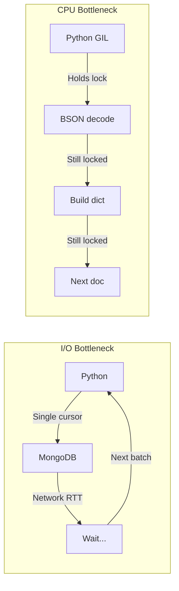
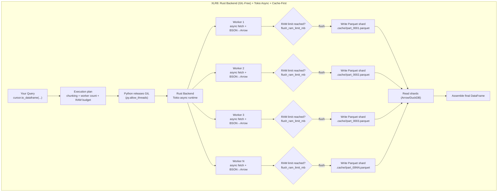
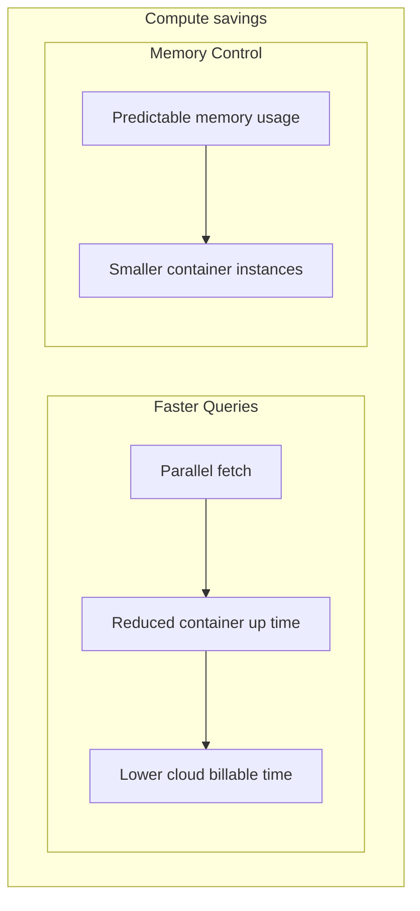
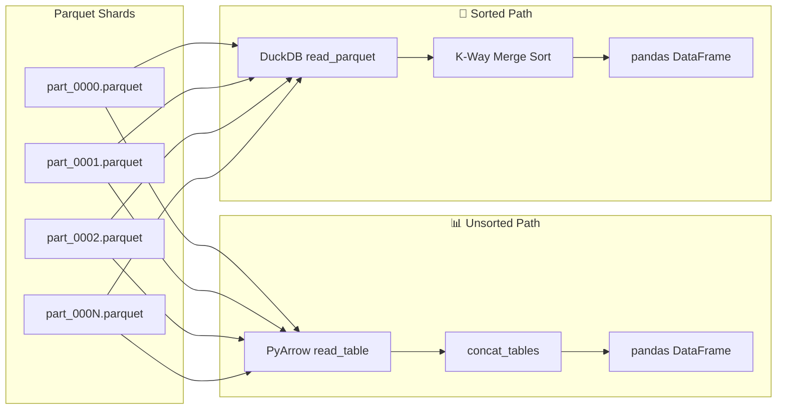
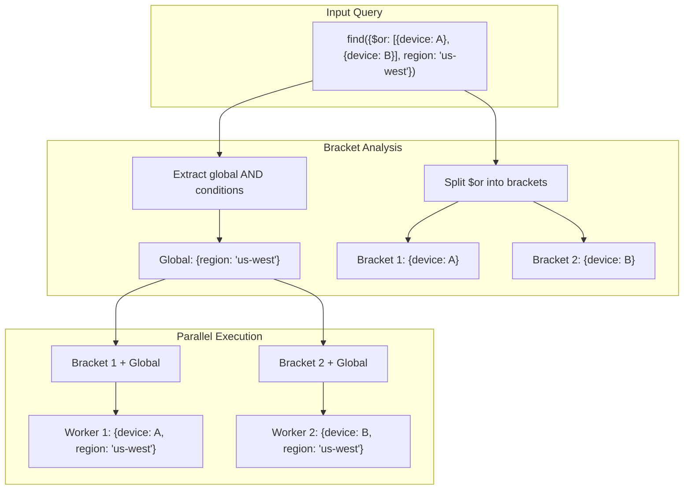
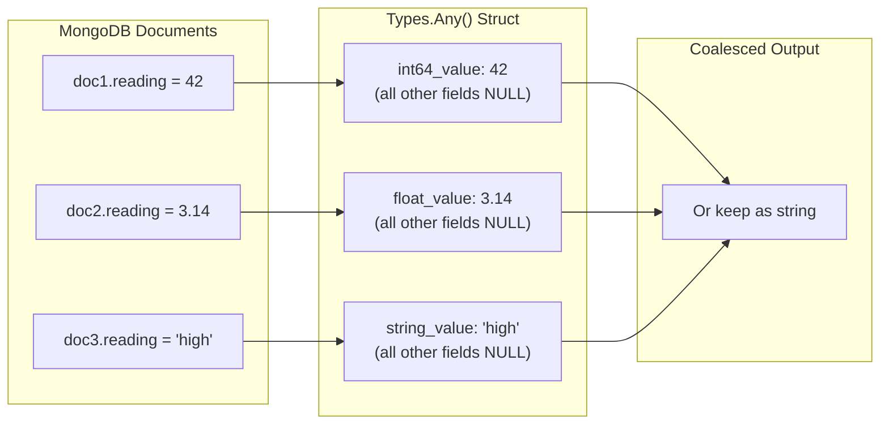

<p align="center">
    
</p>

<p align="center">
  <strong>Accelerate MongoDB analytical queries with parallel execution and Parquet caching.</strong>
</p>
<p align="center">
  <strong>Suitable for timeseries data.</strong>
</p>
<p align="center">
  <em>Faster Queries → Less Memory → Real Savings</em>
</p>

<p align="center">
  <a href="https://pypi.org/project/xlr8/"></a>
    <a href="https://www.python.org/"></a>
    <a href="LICENSE"></a>
    <a href="#performance-benchmarks"></a>
</p>

<p align="center">
  <strong>🦀 Rust-Backed</strong> · <strong>⚡ Up to 4x Faster Queries</strong> · <strong>📦 10-12x Compression</strong> · <strong>📊 Configurable Memory Limits</strong>
</p>

---

## Minimal Code Changes

```python
# Before: PyMongo
df = pd.DataFrame(collection.find(query))

# After: XLR8 - just wrap and go!
xlr8_collection = accelerate(collection, schema, mongo_uri)
df = xlr8_collection.find(query).to_dataframe()
```

> `mongo_uri` can be a `str` or a `Callable[[], str]` for dynamic credential rotation.

That's it. Same query syntax, same DataFrame output - just faster.

---

## The Problem

When running analytical queries over large MongoDB collections, you encounter two fundamental bottlenecks:



**I/O Bound**: PyMongo uses a single cursor, fetching documents one batch at a time. Your CPU sits idle waiting for network round trips.

**CPU/GIL Bound**: Even with the data in hand, Python's Global Interpreter Lock (GIL) means BSON decoding and DataFrame construction happen on a single core.

These aren't PyMongo limitations — they're inherent to Python's single-threaded design. XLR8 provides a solution.

---

## How XLR8 Solves It



XLR8 releases Python's GIL and hands execution to a Rust backend powered by Tokio's async runtime. Multiple workers fetch from MongoDB in parallel, convert BSON to Arrow, and write Parquet shards, all without touching the GIL.

The result? Your analytical queries run **up to 4x faster**, especially for large result sets.

---

## Installation

```bash
pip install xlr8
```

XLR8 requires Python 3.11+ and includes pre-compiled Rust extensions.

---

## Quick Start

```python
from pymongo import MongoClient
from xlr8 import accelerate, Schema, Types
from datetime import datetime, timezone, timedelta
from bson import ObjectId

# Connect to MongoDB
client = MongoClient("mongodb://localhost:27017")
collection = client["iot"]["sensor_readings"]

# Define your schema
schema = Schema(
    time_field="timestamp",
    fields={
        "timestamp": Types.Timestamp("ms", tz="UTC"),
        "device_id": Types.ObjectId(),
        "reading": Types.Any(),  # Handles int, float, string dynamically
    },
    avg_doc_size_bytes=200,
)

# Wrap collection with XLR8
xlr8_col = accelerate(collection, schema=schema, mongo_uri="mongodb://localhost:27017")

# Query like normal PyMongo
cursor = xlr8_col.find({
    "device_id": ObjectId("507f1f77bcf86cd799439011"),
    "timestamp": {"$gte": datetime(2024, 1, 1, tzinfo=timezone.utc),
                  "$lt": datetime(2024, 6, 1, tzinfo=timezone.utc)}
}).sort("timestamp", 1)

# Get DataFrame - parallel fetch, cached for reuse
df = cursor.to_dataframe(
    chunking_granularity=timedelta(days=7),
    max_workers=8,
)
```

---

## Key Features

<table>
<tr>
<td width="50%" valign="top">

### 🦀 GIL-Free Rust Backend
Python's GIL is released via `py.allow_threads()`. Rust's Tokio runtime handles async I/O and CPU-intensive work across all cores.

</td>
<td width="50%" valign="top">

### ⚡ Parallel MongoDB Fetching
Queries are split into time-based chunks. Each worker maintains its own MongoDB connection, fetching in parallel.

</td>
</tr>
<tr>
<td width="50%" valign="top">

### 💾 Query-Aware Cache + MQL-on-Cache
Data is stored in a query-hash folder. Supply `start_date`/`end_date` to filter through the cache, or use `create_cache()` → `CacheHandler.find()` to run **new MQL queries directly against cached Parquet** - no MongoDB round trip needed.

</td>
<td width="50%" valign="top">

### 🔀 Automatic `$or` Parallelization

`$or` queries are automatically split into **independent "brackets"** that can be executed in parallel.

- **`$or`**: each branch becomes its own bracket (while shared filters are kept as global constraints).
- **`$in`**: stays intact within each bracket - MongoDB handles it efficiently with index scans.

Before execution, XLR8 builds an **execution plan** that detects **overlapping brackets** (cases where multiple brackets could match the same document) and ensures results are **correct and deterministic**. This behavior is covered by extensive tests to prevent duplicates or missing rows.
</td>
</tr>
<tr>
<td width="50%" valign="top">

### 🔀 DuckDB K-Way Merge
When sorting is required, DuckDB performs a GIL-free K-way merge across sorted shards — O(N log K) complexity.

</td>
<td width="50%" valign="top">

### 🐻‍❄️ Pandas & Polars Support
`to_dataframe()` returns pandas. `to_polars()` returns native Polars. Choose based on your downstream analytics.

</td>
</tr>
<tr>
<td width="50%" valign="top">

### 📊 Memory-Controlled Execution
Set `flush_ram_limit_mb` to cap total RAM usage. The planner divides it across workers. Process large datasets without OOM errors.

</td>
<td width="50%" valign="top">

### 📤 Stream to Data Lakes
`stream_to_callback()` partitions data by time and custom fields — perfect for S3/GCS ingestion pipelines.

</td>
</tr>
</table>

---

## Cloud & Container Benefits

XLR8's architecture provides specific advantages in cloud environments:



| Benefit | How XLR8 Helps |
|---------|----------------|
| **Reduced container runtime** | Parallel execution finishes faster → lower billable seconds |
| **Cache-first processing** | Fetch once, query many times with MQL filters - no MongoDB needed after cache |
| **Smaller instances** | Memory control via `flush_ram_limit_mb` allows smaller container sizes |
| **Predictable costs** | Consistent memory footprint = consistent billing |

---

## Performance Benchmarks

Real-world benchmarks comparing XLR8 against vanilla PyMongo + pandas on a production-like workload.

### Test Environment

| Component | Specification |
|-----------|---------------|
| **MongoDB** | Atlas M30 (General), GCP europe-west2 (London) |
| **Compute** | GCP Cloud Run Jobs, 8 vCPU / 32 GB RAM, europe-west2 |
| **Dataset** | Forex candlestick data, 27 currency pairs, ~54K docs/day |
| **Query** | Time-range filter + `$in` on 27 instruments |

### Methodology

- **PyMongo baseline**: Stream cursor → build DataFrames in 300k-row batches → `pd.concat()`
- **XLR8**: `cursor.to_dataframe(max_workers=14, chunking_granularity=timedelta(days=4), cache_read=False)`
- Each test runs sequentially to avoid database contention

### Results

| Period | Rows | PyMongo Time | XLR8 Time | **Speedup** |
|--------|-----:|-------------:|----------:|:-----------:|
| 3 months | 4.8M | 89.5s | 31.1s | **2.9x** |
| 6 months | 9.8M | 177.4s | 54.1s | **3.3x** |
| 1 year | 19.7M | 371.2s | 109.3s | **3.4x** |
| 1.5 years | 29.8M | 555.5s | 157.4s | **3.5x** |
| 2 years | 39.7M | 760.7s | 204.0s | **3.7x** |
| 2.5 years | 49.7M | 949.5s | 252.6s | **3.8x** |

### Visualization

<p align="center">
  
</p>

### Key Takeaways

- **Consistent 3-4x speedup** across all data sizes
- **Throughput**: XLR8 sustains ~180-195K rows/sec vs PyMongo's ~52-55K rows/sec
- **Scales linearly**: Speedup improves with larger datasets as parallelism amortizes overhead
- **Memory bounded**: Except for the final DataFrame assembly step, the planner ensures each worker flushes data to cache before the memory limit is breached. Use `start_date`/`end_date` arguments or `to_dataframe_batches()` to completely control memory usage and avoid OOM errors.

> 💡 With caching, subsequent queries on the same data complete in seconds (cache hit), making repeated analytics bypass network trips.

---

## When to Use XLR8

| Use Case | XLR8 Fit | Why |
|----------|:--------:|-----|
| Analytics on 100K+ documents | ✅ **Great** | Parallel fetch + caching provides meaningful speedup |
| Repeated queries on same data | ✅ **Great** | Cache hit avoids network entirely |
| Time-series IoT/sensor data | ✅ **Great** | Time-based chunking is native to the design |
| Multi-device `$or` queries | ✅ **Great** | Automatic bracket parallelization |
| One-off small queries | ➖ Neutral | Works fine, but overhead may not be worth it |
| Single document lookups | ❌ Skip | PyMongo is already optimal for this, so XLR8 sends the query to PyMongo under the hood. |
| Write-heavy workloads | ❌ Skip | XLR8 accelerates reads, not writes. Write operations are sent to PyMongo under the hood. |

---

## Five Ways to Get Your Data

### 1. `to_dataframe()` - Full DataFrame Load

```python
df = cursor.to_dataframe(
    chunking_granularity=timedelta(days=7),
    max_workers=8,
    flush_ram_limit_mb=512,
)
```
**Best for**: Analytical queries where you need all data in memory.

### 2. `to_polars()` - Native Polars DataFrame

```python
df = cursor.to_polars(
    chunking_granularity=timedelta(days=7),
    any_type_strategy="float",
)
```
**Best for**: High-performance analytics with Polars' lazy evaluation.

### 3. `to_dataframe_batches()` - Memory-Efficient Streaming

```python
for batch_df in cursor.to_dataframe_batches(batch_size=50_000):
    process(batch_df)  # Only 50K rows in memory at a time
```
**Best for**: Datasets larger than available RAM.

### 4. `stream_to_callback()` - Data Lake Population

```python
def upload_to_s3(table: pa.Table, metadata: dict):
    week = metadata["time_start"].strftime("%Y-%W")
    path = f"s3://bucket/week={week}.parquet"
    pq.write_table(table, path)

cursor.stream_to_callback(
    callback=upload_to_s3,
    partition_time_delta=timedelta(weeks=1),
    partition_by="device_id",
)
```
**Best for**: ETL pipelines, data lake ingestion.

### 5. `create_cache()` + `CacheHandler` - Query Cache with MQL

```python
# Step 1: Populate cache once (no DataFrame materialized)
handler = cursor.create_cache(
    chunking_granularity=timedelta(days=30),
    max_workers=8,
)

# Step 2: Query cached Parquet with NEW MQL filters - zero MongoDB round trips!
df1 = handler.find({"status": "active"}).to_dataframe()
df2 = handler.find({"value": {"$gt": 100}}).sort("timestamp", -1).limit(50).to_dataframe()
df3 = handler.find({"sensor_id": {"$in": ["A", "B"]}}).to_polars()

# Step 3: Stream cached data to a data lake with MQL filtering
handler.find({"region": "us-west"}).stream_to_callback(
    callback=upload_to_s3,
    partition_time_delta=timedelta(weeks=1),
    partition_by="device_id",
)
```
**Best for**: Fetch once from MongoDB, then run **many different MQL queries** against the cached Parquet without any network trips. Supported operators: `$eq`, `$ne`, `$gt`, `$gte`, `$lt`, `$lte`, `$in`, `$nin`, `$regex`, `$exists`, `$and`, `$or`, `$nor`, `$not`, and more.

---

## Architecture Deep-Dive

<details>
<summary><strong>Click to expand the full pipeline</strong></summary>

### DataFrame Assembly



**Unsorted**: PyArrow reads all shards, concatenates, converts to pandas.

**Sorted**: DuckDB reads Parquet directly (its own reader), performs K-way merge in a single pass, returns sorted DataFrame.

</details>

---

## Query Splitting: Brackets

<details>
<summary><strong>How XLR8 parallelizes complex queries</strong></summary>

XLR8 analyzes your query filter and extracts parallelizable "brackets":




### How Parallelism Works

**XLR8 parallelizes queries in TWO ways:**

1. **Time Chunking** (primary) - Your time range is split into smaller chunks that run in parallel
2. **`$or` Splitting** (secondary) - Top-level `$or` branches become separate work units

### The Simple Rule

| Query Pattern | Brackets | How Parallelism Works |
|---------------|----------|----------------------|
| No `$or`, just filters + time range | **1 bracket** | Time chunking only |
| `$in` without `$or` | **1 bracket** | Time chunking only (MongoDB handles `$in` efficiently) |
| Top-level `$or` with disjoint branches | **N brackets** | Each branch × time chunks |
| `$or` with negation (`$nin`, `$ne`, `$not`, `$nor`) | **1 bracket** | Time chunking only (overlap risk) |
| `$or` nested inside `$nor`, `$and`, etc. | **1 bracket** | Time chunking only (nested = not split) |
| `$expr`, `$text`, `$near`, geospatial | **0 brackets** | Single-worker fallback |

### Collections Where XLR8 Shines

XLR8 is designed for **time-series analytical workloads**. It's most useful when:

**Your collection has:**
- ✅ A **time field** (timestamp, createdAt, recordedAt, etc.)
- ✅ **Large result sets** (100K+ documents per query)
- ✅ **Read-heavy** analytical queries
- ✅ Documents that are **naturally ordered by time**

**Ideal use cases:**

| Domain | Example Collections |
|--------|---------------------|
| **IoT / Sensors** | `sensor_readings`, `telemetry`, `device_logs` |
| **Finance** | `candlesticks`, `trades`, `tick_data`, `transactions` |
| **Observability** | `logs`, `metrics`, `events`, `traces` |
| **Analytics** | `page_views`, `user_events`, `sessions` |
| **Time-series** | Any collection with timestamp fields which can be used for chunking |

</details>

---

## Types.Any(): Handling Mixed Types

<details>
<summary><strong>How XLR8 handles MongoDB's flexible typing</strong></summary>

MongoDB fields can contain different types across documents. `Types.Any()` stores each value in a **13-field bitmap struct** — exactly one sub-field holds the value, all others are NULL:



**13 struct sub-fields** (exactly one populated, rest NULL):

| Sub-field | BSON Type | Arrow Storage |
|-----------|-----------|---------------|
| `float_value` | Double | Float64 |
| `int32_value` | 32-bit Integer | Int32 |
| `int64_value` | 64-bit Integer | Int64 |
| `string_value` | String (UTF-8) | Utf8 |
| `objectid_value` | ObjectId | Utf8 (hex string) |
| `decimal128_value` | Decimal128 | Utf8 (string) |
| `regex_value` | Regex | Utf8 (pattern) |
| `binary_value` | Binary | Utf8 (base64) |
| `document_value` | Document | Utf8 (JSON) |
| `array_value` | Array | Utf8 (JSON) |
| `bool_value` | Boolean | Boolean |
| `datetime_value` | Date | Timestamp[ms] |
| `null_value` | Null | Boolean indicator |

Encoding/decoding happens in Rust via `encode_any_values_to_arrow()` / `decode_any_struct_arrow()`. When reading back, the first non-NULL sub-field is coalesced to produce the final Python value.

</details>

---

## API Reference

<details>
<summary><strong><code>accelerate(collection, schema, mongo_uri)</code></strong></summary>

```python
xlr8_col = accelerate(
    collection,                              # PyMongo collection
    schema=schema,                           # XLR8 Schema
    mongo_uri="mongodb://localhost:27017",   # Required for Rust backend
)
```

</details>

<details>
<summary><strong><code>Schema(time_field, fields, avg_doc_size_bytes)</code></strong></summary>

```python
schema = Schema(
    time_field="timestamp",
    fields={
        "timestamp": Types.Timestamp("ms", tz="UTC"),
        "device_id": Types.ObjectId(),
        "reading": Types.Any(),
        "metadata.region": Types.String(),  # Nested field access
    },
    avg_doc_size_bytes=250,
)
```

</details>

<details>
<summary><strong><code>cursor.to_dataframe(**kwargs)</code></strong></summary>

| Parameter | Type | Default | Description |
|-----------|------|---------|-------------|
| `chunking_granularity` | `timedelta` | `None` | Time chunk size (required for parallel) |
| `max_workers` | `int` | `4` | Parallel worker count |
| `flush_ram_limit_mb` | `int` | `512` | Total RAM limit |
| `row_group_size` | `int` | `None` | Parquet row group size |
| `cache_read` | `bool` | `True` | Read from cache if available |
| `cache_write` | `bool` | `True` | Write results to cache |
| `start_date` | `datetime` | `None` | Filter cached data from this date (inclusive, tz-aware) |
| `end_date` | `datetime` | `None` | Filter cached data until this date (exclusive, tz-aware) |

</details>

<details>
<summary><strong><code>cursor.create_cache(**kwargs)</code></strong></summary>

Populates the Parquet cache without reading back into a DataFrame. Returns a `CacheHandler`.

| Parameter | Type | Default | Description |
|-----------|------|---------|-------------|
| `chunking_granularity` | `timedelta` | `None` | Time chunk size (required for parallel) |
| `max_workers` | `int` | `4` | Parallel worker count |
| `flush_ram_limit_mb` | `int` | `512` | Total RAM limit |
| `row_group_size` | `int` | `None` | Parquet row group size |
| `force` | `bool` | `False` | Re-fetch from MongoDB even if cache exists |

If population fails mid-way (network error, etc.), the partial cache is **automatically cleaned up** to prevent subsequent reads from returning incomplete data.

</details>

<details>
<summary><strong><code>CacheHandler.find(filter, projection)</code></strong></summary>

Query cached Parquet files with MQL filters - no MongoDB connection needed.

```python
handler = cursor.create_cache(chunking_granularity=timedelta(days=30))

# All methods return a CacheCursor with chaining support
cursor = handler.find({"status": "active"})
cursor = cursor.sort("timestamp", -1).limit(100).skip(50)
df = cursor.to_dataframe()
```

**CacheCursor output methods**: `to_dataframe()`, `to_polars()`, `to_dataframe_batches()`, `stream_to_callback()`

**CacheCursor chaining methods**: `sort()`, `limit()`, `skip()`, `projection()`, `explain()`

**Supported MQL operators**: `$eq`, `$ne`, `$gt`, `$gte`, `$lt`, `$lte`, `$in`, `$nin`, `$exists`, `$regex`, `$mod`, `$type`, `$all`, `$elemMatch`, `$size`, `$and`, `$or`, `$nor`, `$not`, bitwise operators. Unsupported: geospatial, `$expr`, `$where`, `$text`, Atlas Search.

</details>

<details>
<summary><strong>Type Reference</strong></summary>

| Type | Parquet Storage | Example |
|------|-----------------|---------|
| `Types.String()` | UTF-8 | `"hello"` |
| `Types.Int()` | Int64 | `42` |
| `Types.Float()` | Float64 | `3.14` |
| `Types.Bool()` | Bool | `True` |
| `Types.Timestamp(unit, tz)` | Timestamp | `datetime(...)` |
| `Types.ObjectId()` | String | `ObjectId("...")` |
| `Types.Any()` | 13-field Struct | mixed types |
| `Types.List(element_type)` | List | `[1, 2, 3]` |

</details>

---

## Tips & Tricks

<details>
<summary><strong>Choosing chunk granularity</strong></summary>

```python
# Rule of thumb: 2-4x more chunks than workers

# 1 month of data, 8 workers → ~3 day chunks
chunking_granularity=timedelta(days=3)

# 1 year of data, 8 workers → ~2 week chunks
chunking_granularity=timedelta(days=14)
```

</details>

<details>
<summary><strong>Tuning RAM usage</strong></summary>

```python
# More RAM = fewer files = faster reads
flush_ram_limit_mb=2000

# Less RAM = more files = lower memory footprint
flush_ram_limit_mb=256
```

</details>

<details>
<summary><strong>Using projections</strong></summary>

```python
# Only fetch the fields you need
cursor = xlr8_col.find(
    {"device_id": device_id, "timestamp": time_range},
    {"timestamp": 1, "reading": 1}  # Projection
)
```

</details>

<details>
<summary><strong>Fetch once, query many times with MQL</strong></summary>

```python
# 1. Create cache with a broad time range
handler = xlr8_col.find({
    "timestamp": {"$gte": start, "$lt": end}
}).create_cache(chunking_granularity=timedelta(days=30))

# 2. Now run MANY different queries against the same cached data
active = handler.find({"status": "active"}).to_dataframe()
high_val = handler.find({"value": {"$gt": 100}}).sort("value", -1).to_dataframe()
sensors = handler.find({"sensor_id": {"$in": ["A", "B", "C"]}}).to_polars()

# 3. All of these run in milliseconds - zero MongoDB round trips!
```

This is ideal for dashboards, notebooks, and iterative analysis where you fetch a broad dataset once and slice it many ways.

</details>

---

## Contributing

Contributions welcome! ❤️ Please follow these guidelines:

### Required Contribution Flow

1. **Open an issue first**  
   Every proposed change must begin with an issue.

2. **Wait for triage / approval**  
   A maintainer must review the issue and confirm that the change is approved for implementation.

3. **Submit a PR linked to the approved issue**  
   Once the issue has been triaged and approved, you may open a pull request that clearly links back to that issue.

> **Pull requests opened without a prior issue will be closed.**  
> We use issues to discuss scope, confirm fit, avoid duplicated work, and agree on the right implementation direction before code is submitted.

**Setup**
```bash
git clone https://github.com/XLR8-DB/xlr8.git
cd xlr8
uv sync
uv run pytest
```

**Guidelines**
- Use [conventional commits](https://www.conventionalcommits.org/): `feat:`, `fix:`, `docs:`, `test:`, `refactor:`
- Run `uv run pytest` before submitting - all tests must pass
- Keep PRs focused - one feature or fix per PR
- Add tests for new functionality

**Questions?** Open an issue or start a discussion.

Author: Kapil Parekh
